## Vista general

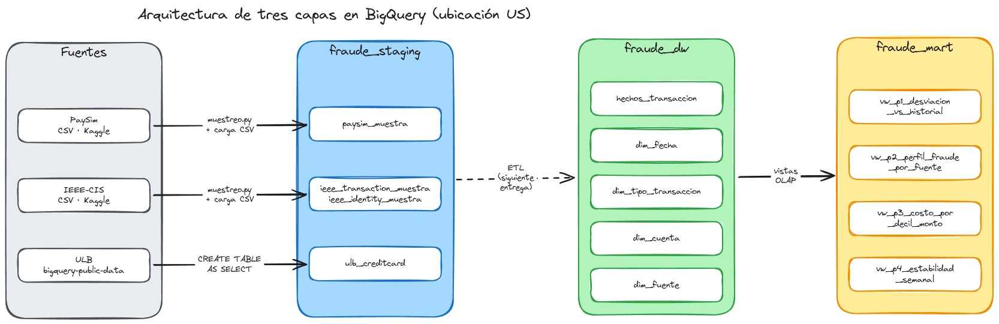

Los tres datasets están en la misma ubicación (`US`). Además de que BigQuery no deja consultar entre
regiones, la tabla pública de ULB está en `US`, así que staging tenía que quedar ahí para poder
copiarla.

| Capa | Dataset | Para qué sirve | Qué tiene en E1 |
|---|---|---|---|
| Staging | `fraude_staging` | Guardar los datos tal como vienen de la fuente, sin limpiar, sabiendo de dónde y cuándo se cargaron | Muestras de PaySim e IEEE-CIS (menos de 100 MB, muestreadas por cuenta) y la copia completa de ULB |
| DW | `fraude_dw` | El [esquema estrella](estrella.qmd): una tabla de hechos por transacción y las dimensiones compartidas | Las tablas creadas con DDL, todavía vacías. Llenarlas toca en la fase de preparación |
| DataMart | `fraude_mart` | Contestar cada pregunta de E0 con consultas OLAP sobre la estrella | Una vista por pregunta (P1 a P4) |

## Creación de los datasets

```sql

```

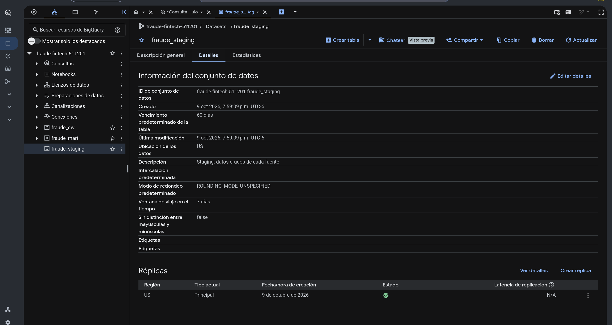

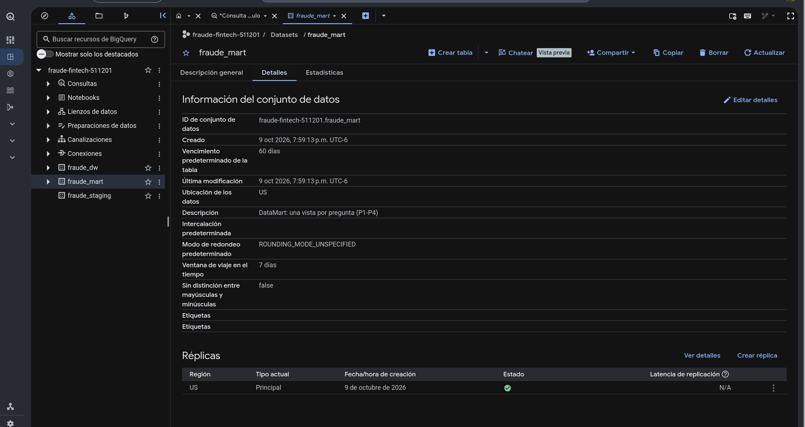

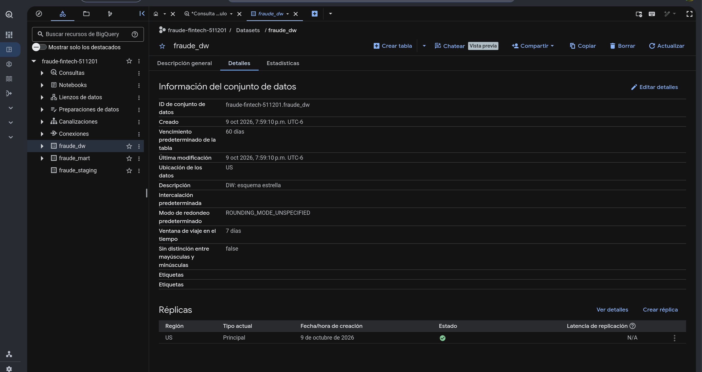


## Capa staging

### Por qué una muestra y cómo la sacamos

La consola de BigQuery solo deja subir archivos de hasta ~100 MB, y PaySim (~494 MB) e IEEE-CIS
(`train_transaction`, ~650 MB) pesan más. El script de abajo
toma el 10 % de las cuentas con un hash y se queda con todas sus transacciones. Muestreamos por
cuenta y no por fila porque así cada cuenta conserva su historial completo, que es lo que necesita
P1. El script copia las filas tal cual, sin cambiar ningún valor.

::: {.callout-note collapse="true"}
## Script de muestreo (`muestreo.py`)

```python

```
:::

| Tabla de staging | Fuente | Se muestrea por | Cómo se cargó |
|---|---|---|---|
| `paysim_muestra` | F1 PaySim | `nameDest` (cuenta destino) | Subida de CSV con esquema automático |
| `ieee_transaction_muestra` | F2 IEEE-CIS | `card1` (tarjeta) | Subida de CSV con esquema automático |
| `ieee_identity_muestra` | F2 IEEE-CIS | Los `TransactionID` de la tabla anterior | Subida de CSV con esquema automático |
| `ulb_creditcard` | F3 ULB | No se muestrea (~285 mil filas) | `CREATE TABLE AS SELECT` desde el dataset público |

```sql

```

### Evidencia de carga

#### paysim_muestra

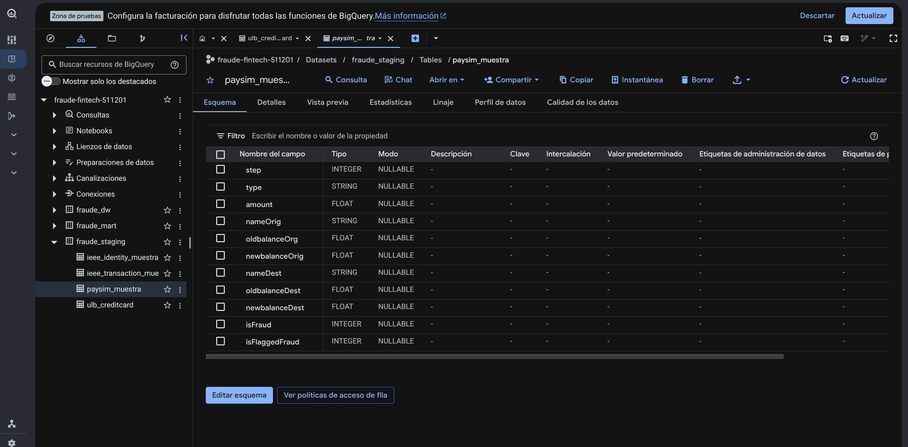
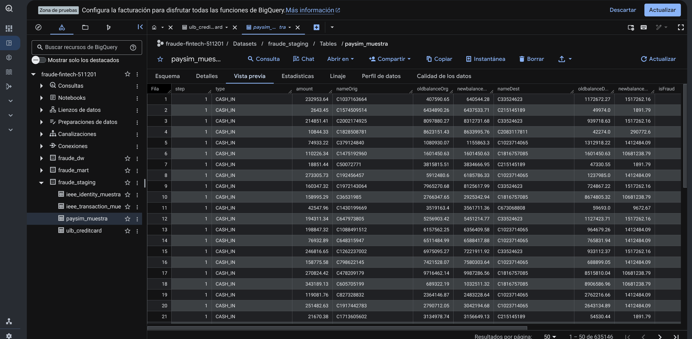

#### ieee_transaction_muestra
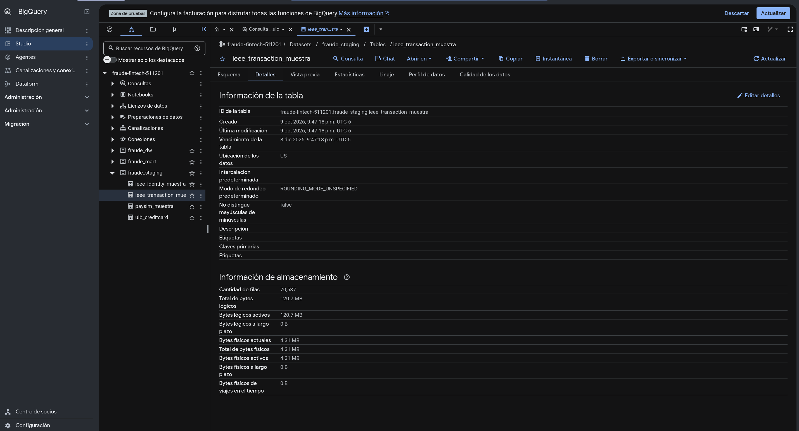
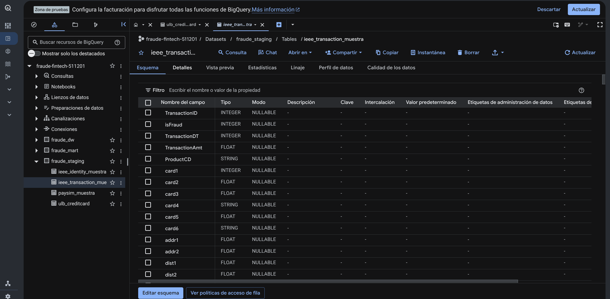
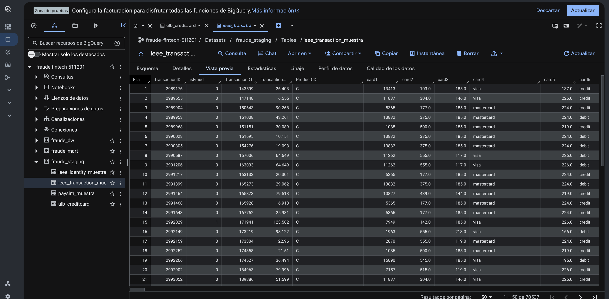

#### ieee_identity_muestra
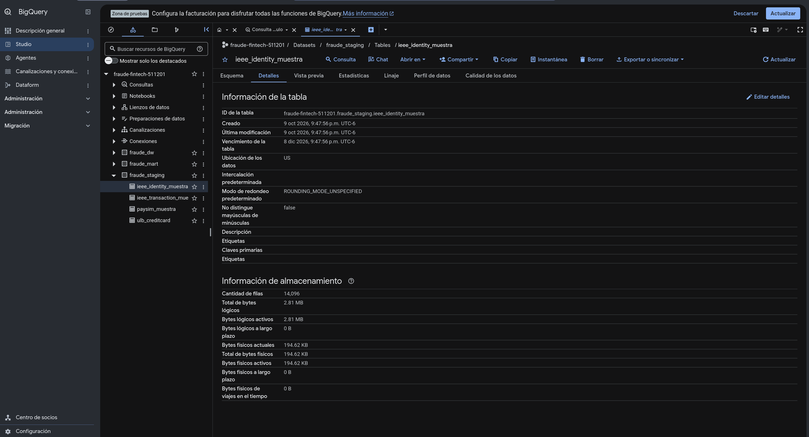
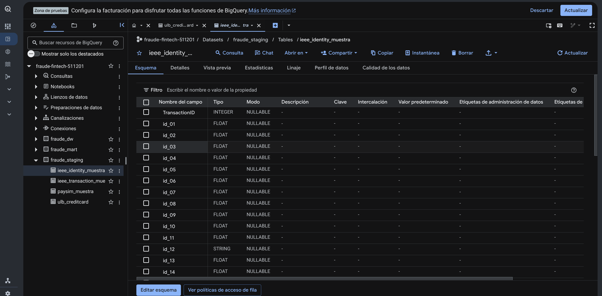
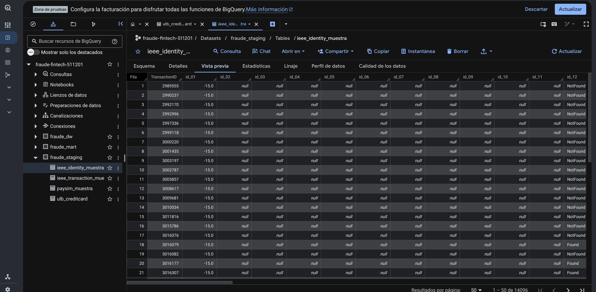

#### ulb_creditcard
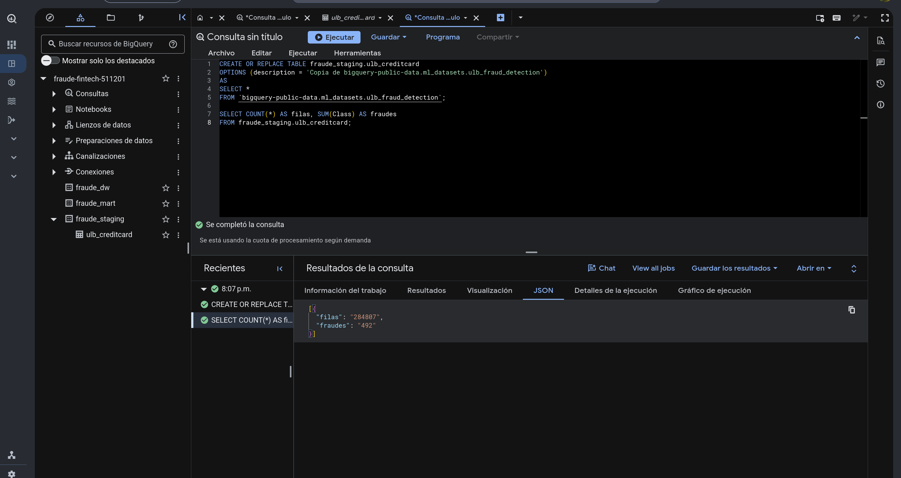
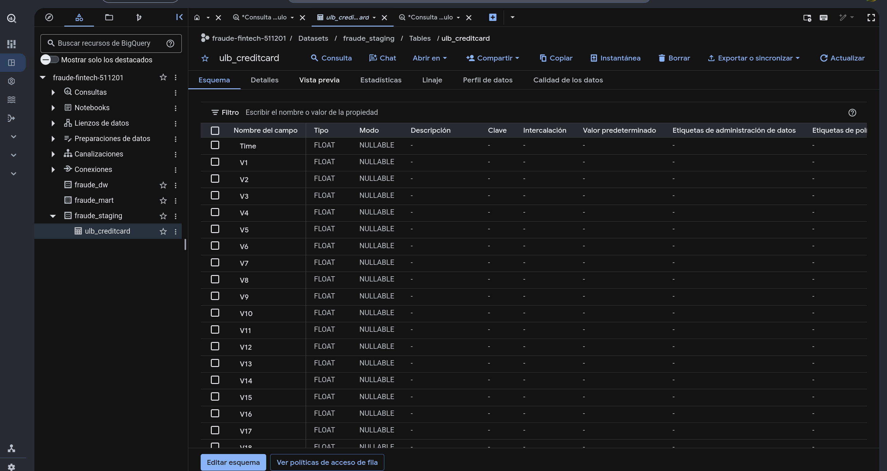
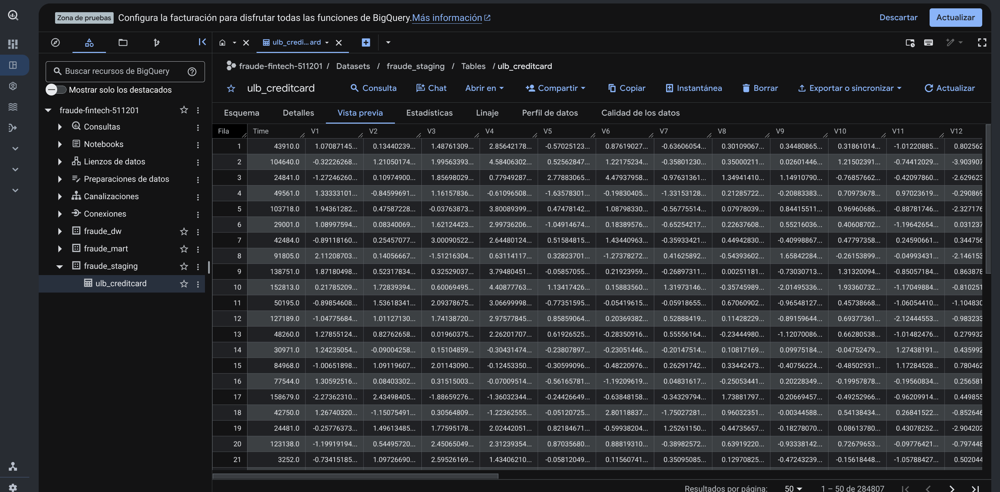

## Capa DW

El DDL de las tablas y por qué elegimos cada una están en
[Esquema estrella](estrella.qmd#ddl-ejecutado-en-bigquery).

## Capa DataMart

Hicimos una vista por pregunta de E0. Todas usan operaciones OLAP: funciones de ventana en P1, P3 y
P4, `GROUPING SETS` en P2 y `ROLLUP` en P3. Como el DW todavía está vacío no regresan filas, pero
BigQuery las acepta como consultas válidas.

| Vista | Pregunta | Operación OLAP | Qué regresa |
|---|---|---|---|
| `vw_p1_desviacion_vs_historial` | P1 (ajustada) | Ventanas con `ROWS BETWEEN UNBOUNDED PRECEDING AND 1 PRECEDING` y `LAG` | Por transacción: z-score del monto contra el historial anterior de su cuenta, si pasa el máximo que había tenido, horas desde la transacción anterior y si la cuenta no tenía historial |
| `vw_p2_perfil_fraude_por_fuente` | P2 | `GROUPING SETS` y `GROUPING()` | Tasa de fraude y monto promedio de fraude contra legítimo, en tres niveles: sintético/real, fuente y categoría |
| `vw_p3_costo_por_decil_monto` | P3 | `NTILE`, `ROLLUP` y `HAVING GROUPING()` | Por fuente, categoría y decil de monto: cuánto dinero hay en fraude, cuánto atrapa la regla fija y el costo esperado (4.59 × monto no detectado + falsos positivos) |
| `vw_p4_estabilidad_semanal` | P4 | Promedio móvil de 3 semanas y `LAG` | Serie semanal por fuente con tasa de fraude, monto promedio y proporción de cuentas nuevas, y cuánto cambian de una semana a otra |

```sql

```

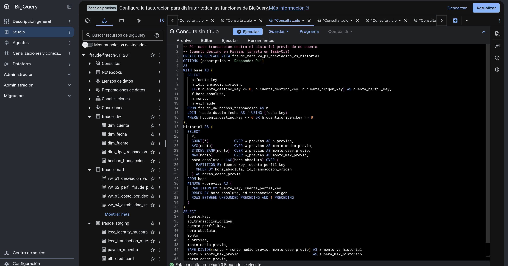
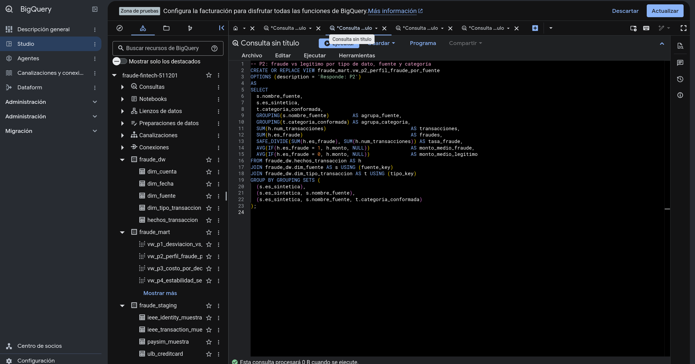
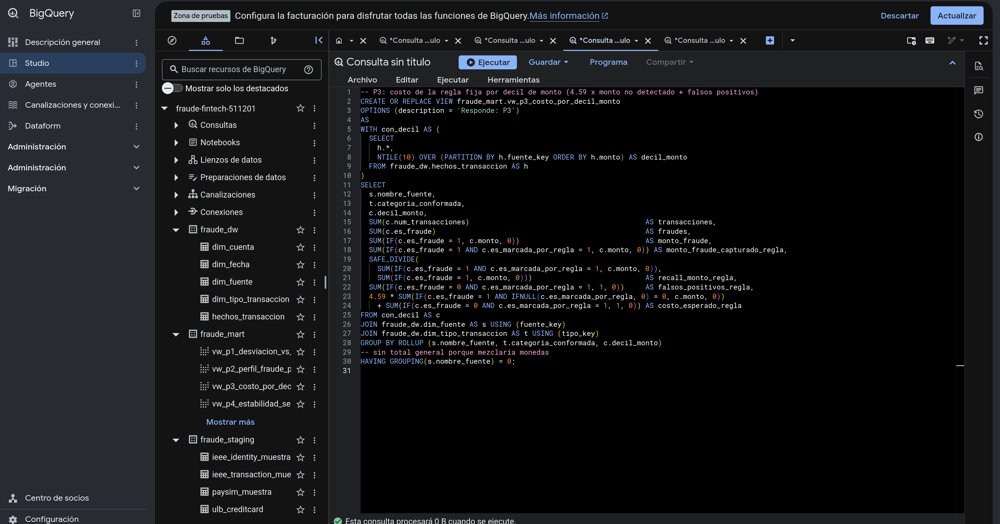
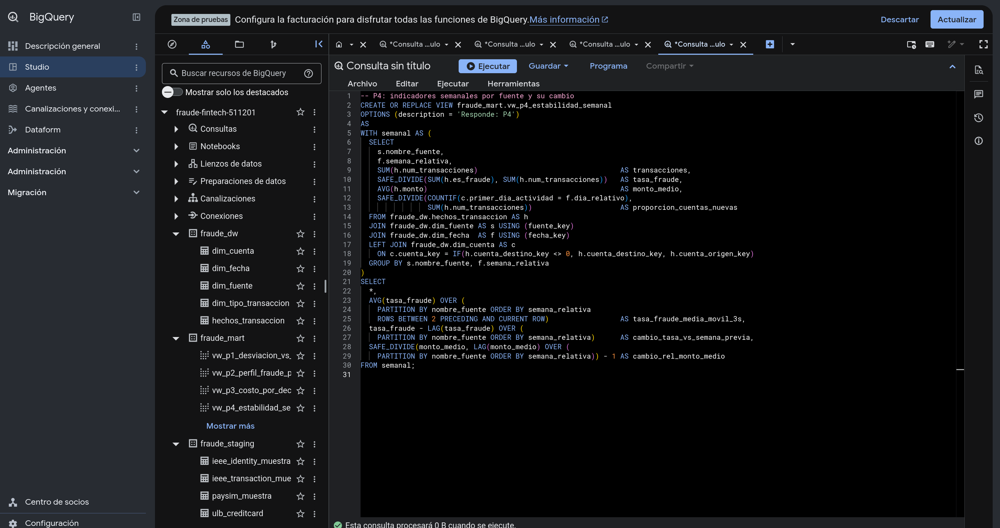
