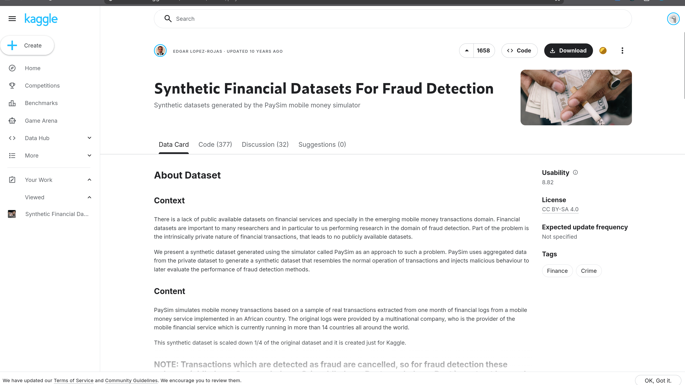
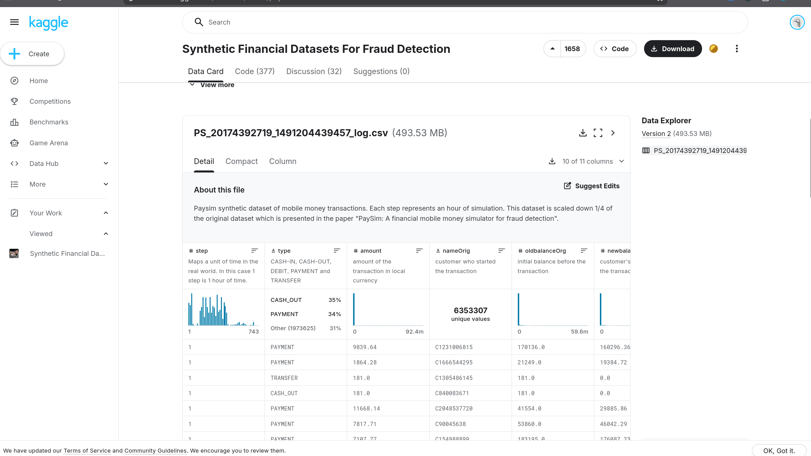
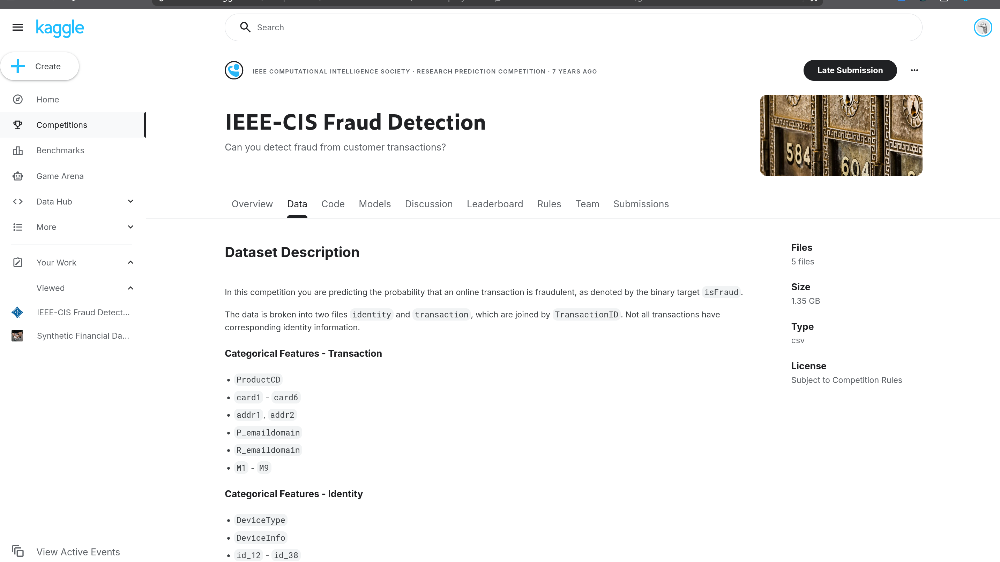
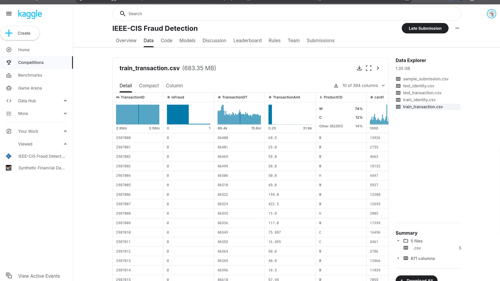
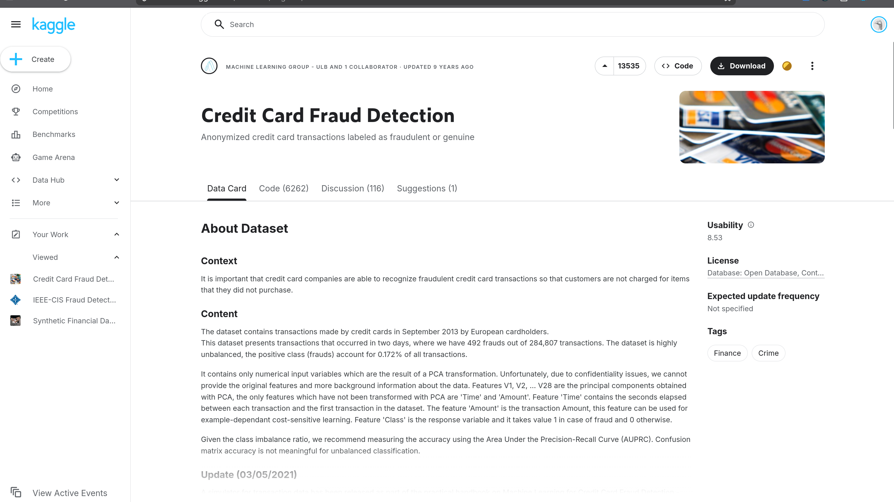
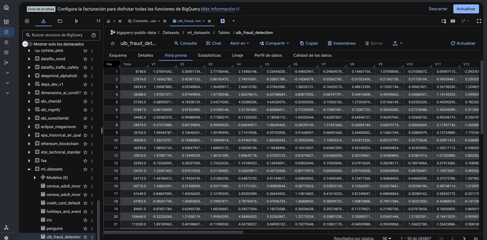

## 1. Proceso de búsqueda

Partimos de las preguntas P1 a P4 de [E0](../E0_comprension_negocio/preguntas.qmd). Para responderlas
necesitábamos como mínimo transacciones individuales con etiqueta de fraude, monto y algún orden en
el tiempo. Idealmente también un identificador de cuenta, para poder armar el historial que pide P1.

| Fecha | Herramienta / portal | Consulta | Qué encontramos |
|---|---|---|---|
| 05-oct-2026 | Claude (búsqueda web) | `bigquery-public-data ml_datasets ulb_fraud_detection credit card fraud table` | La tabla pública existe; Google la usa en uno de sus codelabs |
| 05-oct-2026 | API pública de Kaggle | `ealaxi/paysim1`, `mlg-ulb/creditcardfraud`, `sgpjesus/bank-account-fraud-dataset-neurips-2022` | Dueño, licencia, tamaño y descripción de columnas de cada dataset |
| 05-oct-2026 | Claude (búsqueda web) | `IEEE-CIS Fraud Detection Kaggle train_transaction TransactionDT` | Estructura de archivos: transaction e identity, unidos por `TransactionID` |
| 05-oct-2026 | datos.gob.mx (API CKAN) | `package_search?q=condusef` | 15 conjuntos de CONDUSEF; los de reclamaciones son anuales por institución |
| 05-oct-2026 | Claude (búsqueda web) | `Banxico SIE API REST series sistemas de pago` | La API existe, pide token y solo tiene series agregadas |
| 05-oct-2026 | Claude (búsqueda web) | `INEGI ENIF 2024 microdatos fraude` | La ENIF 2024 existe, pero es una encuesta de hogares |
| 05-oct-2026 | Claude (búsqueda web) y lectura del artículo | `PaySim nameOrig unique values accounts` | Visbeek et al. (2023): solo el 0.15 % de las cuentas origen de PaySim tiene más de una transacción |

## 2. Fuentes candidatas

Para elegir usamos cuatro criterios, en este orden:

1. Que tenga transacciones individuales con etiqueta de fraude.
2. Que se pueda acceder y la licencia permita uso académico.
3. Que sirva para alguna de las preguntas P1 a P4.
4. Que haya al menos dos tipos de acceso distintos (lo pide la entrega).

| # | Fuente | Acceso | Criterio 1 | Criterio 2 | Criterio 3 | Decisión |
|---|---|---|---|---|---|---|
| 1 | PaySim, *Synthetic Financial Datasets for Fraud Detection* | CSV (Kaggle) | Sí | CC BY-SA 4.0 | P1, P3, P4 | Catálogo |
| 2 | IEEE-CIS Fraud Detection (Vesta) | CSV (competencia de Kaggle) | Sí | Reglas de la competencia | P1, P2, P3, P4 | Catálogo |
| 3 | ULB Credit Card Fraud (Worldline y MLG-ULB) | Dataset público de BigQuery | Sí | ODbL | P2, P3 | Catálogo |
| 4 | CONDUSEF, Anuario estadístico (índice de reclamaciones e instituciones más reclamadas) | CSV en datos.gob.mx | No, es anual por institución | CC BY 4.0 | Solo contexto | Descartada |
| 5 | Banxico, SIE API REST | API con token | No, series agregadas sin fraude | Sí | Solo contexto | Descartada |
| 6 | Bank Account Fraud (BAF), NeurIPS 2022 | CSV (Kaggle) | No, son solicitudes de apertura de cuenta | CC BY-NC-SA 4.0 | Ninguna | Descartada |
| 7 | Simulador del *Fraud Detection Handbook* | Código para generar datos | Sí, pero sintético | Sí | Repite lo de PaySim | Descartada |
| 8 | INEGI, ENIF 2024 | Microdatos de encuesta | No, es por persona/hogar | Sí | Solo contexto | Descartada |

Las fuentes mexicanas (4, 5 y 8) son las más cercanas al negocio de E0, pero vienen agregadas por
institución y año, o por persona encuestada. Pegarlas a una tabla de transacciones solo nos dejaría
comparar un total anual contra un mes simulado, y eso no contesta ninguna pregunta. Las seguimos
usando como contexto del problema, igual que en E0. BAF y el simulador del *handbook* son
sintéticos y no aportan algo que PaySim no tenga.

## 3. Catálogo de fuentes

### F1. PaySim

| Campo | Valor |
|---|---|
| Nombre y dueño | *Synthetic Financial Datasets For Fraud Detection*, de Edgar Lopez-Rojas. Artículo: Lopez-Rojas, Elmir y Axelsson, *PaySim: A financial mobile money simulator for fraud detection*, EMSS 2016 |
| URL y acceso | <https://www.kaggle.com/datasets/ealaxi/paysim1>. Se descarga con cuenta de Kaggle |
| Formato y tamaño | Un CSV de ~494 MB (6,362,620 filas, 11 columnas). A staging subimos una muestra de menos de 100 MB |
| Grano | Una transacción |
| Cobertura | 744 pasos de una hora, o sea 30 días simulados. No tiene fechas reales. La simulación se calibró con datos de un servicio de dinero móvil en un país africano. No se actualiza (versión 2, 2017) |
| Licencia y restricciones | CC BY-SA 4.0. Es sintético, así que no hay datos personales. El autor avisa que las columnas de saldo no deben usarse para detectar fraude, porque las transacciones fraudulentas se cancelan y eso filtra la respuesta |
| Llaves de integración | `step` a `dim_fecha`, `type` a `dim_tipo_transaccion`, `nameOrig` y `nameDest` a `dim_cuenta` |
| Preguntas de E0 | P1, P3 (es la única fuente con una regla fija, `isFlaggedFraud`, que sirve de comparación) y P4 |

**Evidencia de verificación**

### F2. IEEE-CIS Fraud Detection

| Campo | Valor |
|---|---|
| Nombre y dueño | IEEE Computational Intelligence Society, con datos de Vesta Corporation (competencia de Kaggle, 2019) |
| URL y acceso | <https://www.kaggle.com/competitions/ieee-fraud-detection/data>. Se descarga con cuenta de Kaggle después de aceptar las reglas |
| Formato y tamaño | CSV: `train_transaction` (590,540 filas, 394 columnas) y `train_identity` (solo una parte de las transacciones), unidos por `TransactionID`. Los archivos `test_*` no traen etiqueta y no los usamos |
| Grano | Una transacción de e-commerce con tarjeta (sin tarjeta presente) |
| Cobertura | Unos 6 meses. `TransactionDT` son segundos desde una fecha de referencia que no se publicó. Datos reales de EE. UU., con ~3.5 % de fraude. No se actualiza |
| Licencia y restricciones | Reglas de la competencia: uso no comercial y académico. Muchas columnas vienen anonimizadas (`C1-C14`, `D1-D15`, `V1-V339`, `id_*`) y no hay identificador de cliente |
| Llaves de integración | `TransactionDT` a `dim_fecha`, `ProductCD` a `dim_tipo_transaccion`, y `card1` + `addr1` como aproximación de cuenta en `dim_cuenta` |
| Preguntas de E0 | P1 (historial por tarjeta), P2 (etiquetas reales), P3 y P4 |

**Evidencia de verificación**

### F3. ULB Credit Card Fraud (BigQuery público)

| Campo | Valor |
|---|---|
| Nombre y dueño | *Credit Card Fraud Detection*, de Worldline y el Machine Learning Group de la Université Libre de Bruxelles |
| URL y acceso | Tabla `bigquery-public-data.ml_datasets.ulb_fraud_detection`, se consulta directo en BigQuery. También está en <https://www.kaggle.com/datasets/mlg-ulb/creditcardfraud> |
| Formato y tamaño | Tabla de BigQuery con 284,807 filas y 31 columnas (~150 MB en CSV) |
| Grano | Una transacción con tarjeta de crédito |
| Cobertura | 2 días de septiembre de 2013, de tarjetahabientes europeos. 492 fraudes (0.172 %). `Time` son segundos desde la primera transacción |
| Licencia y restricciones | ODbL para la base y Database Contents License para el contenido. Las variables `V1` a `V28` vienen de un PCA por confidencialidad, así que no se pueden interpretar ni comparar con otras fuentes |
| Llaves de integración | `Time` a `dim_fecha` y el valor fijo `TARJETA` a `dim_tipo_transaccion`. No tiene cuenta, así que entra como cuenta desconocida en `dim_cuenta` |
| Preguntas de E0 | P2 (segunda fuente real) y P3 (`Amount` para calcular costo por monto) |

**Evidencia de verificación**

## 4. Análisis de integración

Las tres fuentes son de poblaciones distintas: dinero móvil simulado, e-commerce en EE. UU. y
tarjetas en Europa. No comparten ningún identificador, así que no hay forma de unir un registro
de una con otro de otra. Lo que hicimos fue apilarlas en una sola tabla de hechos con el mismo grano
(una transacción) y usar las mismas dimensiones para las tres (`dim_fecha`, `dim_tipo_transaccion`,
`dim_cuenta` y `dim_fuente`). Con eso cada pregunta puede comparar las fuentes lado a lado; por
ejemplo, P2 compara el dato sintético contra el real.

### Cómo llega cada llave a las dimensiones

| Dimensión | PaySim | IEEE-CIS | ULB |
|---|---|---|---|
| `dim_fecha` (día y hora relativos) | `step` en horas (1 a 744): día = ⌊(step−1)/24⌋+1, hora = (step−1) mod 24 | `TransactionDT` en segundos: día = ⌊DT/86400⌋, hora = ⌊DT/3600⌋ mod 24 | `Time` en segundos: día = ⌊Time/86400⌋+1, hora = ⌊Time/3600⌋ mod 24 |
| `dim_tipo_transaccion` | `type`: CASH_IN, CASH_OUT, DEBIT, PAYMENT, TRANSFER | `ProductCD`: W, C, R, H, S | valor fijo `TARJETA` |
| `dim_cuenta` | `nameOrig`, `nameDest` (C = cliente, M = comercio) | `card1` + `addr1` (aproximación, no es oficial) | no hay, se usa `cuenta_key = 0` |
| `dim_fuente` | valor fijo | valor fijo | valor fijo |

### Diferencias de granularidad

Las tres vienen a nivel transacción, así que no hay que agregar ninguna para llegar a un grano
común. Lo que cambia es el detalle del tiempo: PaySim solo llega a la hora, mientras que IEEE-CIS y
ULB llegan al segundo. Por eso `dim_fecha` se queda en día y hora.

### Problemas que vemos venir

Estos problemas los resolvemos en la fase de preparación; aquí solo los dejamos identificados.

1. **No hay fechas reales.** Las tres usan tiempo relativo y cada una empieza en su propio cero.
   `dim_fecha` es relativa, y el "día 3" de una fuente no es el mismo que el de otra.
2. **Monedas distintas.** PaySim usa una moneda local simulada, IEEE-CIS dólares y ULB no dice cuál
   (son tarjetahabientes europeos). Por eso `monto` nunca se suma entre fuentes; en el mart siempre
   se agrupa primero por fuente.
3. **En PaySim las cuentas origen casi no se repiten.** Visbeek et al. (2023) reportan que solo el
   0.15 % de las cuentas origen tiene más de una transacción, contra 83 % de las cuentas destino.
   Por eso el historial de P1 se arma con la cuenta destino (ver la
   [matriz de trazabilidad](trazabilidad.qmd)). Lo vamos a revisar también en nuestra muestra.
4. **IEEE-CIS no trae identificador de cliente.** `card1` + `addr1` es una aproximación que usa mucha
   gente en Kaggle, pero puede juntar a varias personas en una sola cuenta o partir a una en varias.
5. **Los saldos de PaySim filtran la respuesta.** `oldbalanceOrg`, `newbalanceOrig`, etc. se quedan en
   la tabla de hechos para revisar, pero no se van a usar como variables del modelo.
6. **Los tipos de transacción no coinciden.** `type` de PaySim y `ProductCD` de IEEE-CIS no significan
   lo mismo, y los códigos de `ProductCD` no están documentados. Los llevamos a una
   `categoria_conformada`; el mapeo de IEEE-CIS es un supuesto nuestro.
7. **Hay variables que solo existen en una fuente.** Las `V1-V28` de ULB y las `V/C/D/id` de IEEE-CIS
   no entran al hecho común. Se quedan en staging para el modelado de P2.
8. **Las tasas de fraude son muy distintas:** 0.13 % en PaySim, ~3.5 % en IEEE-CIS y 0.172 % en ULB.
   Las comparaciones se hacen por fuente, nunca con todo mezclado.
9. **La cobertura en el tiempo es dispareja.** ULB solo cubre 2 días, así que no sirve para P4.

## Referencias

- Lopez-Rojas, E. A., Elmir, A. y Axelsson, S. (2016). *PaySim: A financial mobile money simulator
  for fraud detection*. 28th European Modeling and Simulation Symposium (EMSS).
- Dal Pozzolo, A., Caelen, O., Johnson, R. A. y Bontempi, G. (2015). *Calibrating Probability with
  Undersampling for Unbalanced Classification*. IEEE SSCI. (Cita que pide el dataset de ULB.)
- Visbeek, S., Acar, E. y den Hengst, F. (2023). *Explainable Fraud Detection with Deep Symbolic
  Classification*. arXiv:2312.00586. <https://arxiv.org/abs/2312.00586>
- Google Cloud. *BigQuery ML for Fraud Detection in Credit card transactions using console* (codelab).
  <https://codelabs.developers.google.com/codelabs/frauddetection-using-console>
- datos.gob.mx. Conjuntos de CONDUSEF: *Anuario Estadístico ... Índice de reclamaciones* e
  *Instituciones más reclamadas* (CC BY 4.0).
- Banco de México. *SIE API REST*. <https://www.banxico.org.mx/SieAPIRest/service/v1/>
