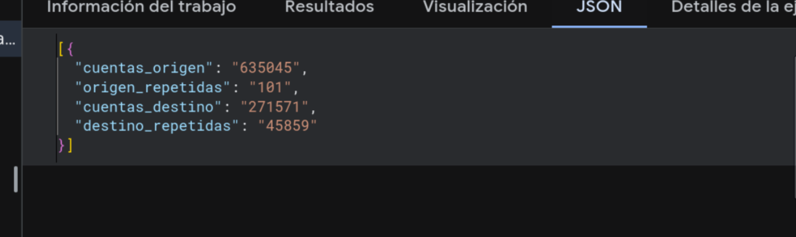

Revisamos la matriz en los dos sentidos:

- que cada pregunta de [E0](../E0_comprension_negocio/preguntas.qmd) tenga un estado y una razón;
- que cada dimensión y cada medida del [esquema estrella](estrella.qmd) conteste al menos una pregunta.

## De la pregunta a la fuente

| Pregunta | Tarea de minería | Métrica (hecho) | Dimensiones | Fuente(s) | Vista del mart | Estado |
|---|---|---|---|---|---|---|
| **P1 (ajustada)**: ¿qué transacciones se comportan como anómalas respecto al historial de la cuenta que sí tiene historial en cada fuente (destino en PaySim, tarjeta en IEEE-CIS), y con qué confianza? | Anomalías por cuenta y calibración | `monto`, `num_transacciones`, `es_fraude` (para calibrar) | `dim_cuenta` (SCD2, roles origen y destino), `dim_fecha` | F1 PaySim, F2 IEEE-CIS | `vw_p1_desviacion_vs_historial` | Parcial (nota 1) |
| **P2**: ¿qué variables separan fraude de legítimo con etiquetas reales, y sirve eso para validar P1? | Clasificación supervisada | `es_fraude`, `monto`, `num_transacciones` | `dim_fuente` (`es_sintetica`), `dim_tipo_transaccion` | F2 IEEE-CIS y F3 ULB (reales), F1 PaySim (para comparar) | `vw_p2_perfil_fraude_por_fuente` | Cubierta. Las variables propias de cada fuente (V, C, D, PCA) se quedan en staging para el modelado |
| **P3**: ¿dónde poner los umbrales alto, medio y bajo para que el costo esperado sea el menor? | Análisis de costos | `monto`, `es_fraude`, `es_marcada_por_regla` | `dim_tipo_transaccion`, `dim_fuente`, `dim_fecha` | F1, F2, F3 | `vw_p3_costo_por_decil_monto` | Parcial (nota 2) |
| **P4**: ¿qué tan estable es el perfil normal de una cuenta con el tiempo y cómo se degrada el modelo? | Validación temporal, *concept drift* | `es_fraude`, `monto`, `num_transacciones` | `dim_fecha` (`semana_relativa`), `dim_cuenta` (versiones SCD2, `primer_dia_actividad`), `dim_fuente` | F1 (30 días), F2 (~6 meses) | `vw_p4_estabilidad_semanal` | Parcial (nota 3) |

### Notas

1. **Por qué ajustamos P1.** Nosotros al reportamos que en PaySim solo el 0.016% de las
   cuentas origen tiene más de una transacción. En E0 entendíamos "historial de cada cuenta" como la
   cuenta que paga, pero así casi ninguna cuenta tendría historial. Por eso en PaySim perfilamos la
   cuenta destino, donde el 16.9 % sí se repite. Eso además coincide con cómo funciona el fraude en el
   simulador: vacían una cuenta con un TRANSFER a otra y después hacen CASH_OUT. En IEEE-CIS
   perfilamos la tarjeta, usando la aproximación `card1` + `addr1`.
   Esto no cambia el objetivo: sigue siendo encontrar anomalías contra el historial propio de una
   cuenta, con una confianza calibrada. El criterio de éxito tampoco cambia, así que no cuenta como
   pivote. También quitamos la variable "cambio de saldo relativo" que habíamos puesto en E0, porque
   el autor de PaySim avisa que los saldos filtran la respuesta.
   Lo que falta de P1 es calibrar la confianza. Para eso se necesita el score del modelo, que llega
   en la fase de modelado; probablemente como una segunda tabla de hechos (`hechos_score`) que use
   las mismas dimensiones.
2. **Por qué P3 es parcial.** En el DW ya está todo lo que pide el cálculo de costo: el monto, la
   etiqueta y la regla fija actual para comparar. Pero los umbrales dependen del score calibrado de
   P1, que todavía no existe. Por ahora la vista calcula el costo de la regla fija, que es contra lo
   que vamos a comparar el modelo. Lo de mandar a revisión humana como máximo el 3 % del volumen
   tampoco se puede medir hasta tener el score.
3. **Por qué P4 es parcial.** No hay fechas reales y los periodos son cortos: 30 días en PaySim,
   unos 6 meses en IEEE-CIS y 2 días en ULB, que por eso no se usa. El cambio en el tiempo lo medimos
   en semanas relativas dentro de cada fuente, no en temporadas reales. En IEEE-CIS, qué tan estable
   se ve un perfil también depende de qué tan buena sea la aproximación de tarjeta.
   
### Fuentes de lo reportado en PaySim

## De cada elemento del esquema a la pregunta

| Elemento | Tipo | Preguntas | ¿Huérfano? |
|---|---|---|---|
| `dim_fecha` | Dimensión | P1 (orden y tiempo entre transacciones), P3, P4 (semanas) | No |
| `dim_cuenta` | Dimensión (2 roles) | P1 (historial), P4 (versiones del perfil y cuentas nuevas) | No |
| `dim_tipo_transaccion` | Dimensión | P2 (fraude por categoría), P3 (costo por categoría) | No |
| `dim_fuente` | Dimensión | P2 (sintético contra real), P3 y P4 (separar monedas y periodos) | No |
| `num_transacciones` | Medida | P1, P2, P3, P4 | No |
| `monto` | Medida | P1, P2, P3 | No |
| `es_fraude` | Medida | P1 (calibración), P2, P3, P4 | No |
| `es_marcada_por_regla` | Medida | P3 (la regla fija como punto de comparación) | No |
| `saldo_origen_antes`, `saldo_origen_despues` | Medida (no aditiva) | No entran como variable a ninguna pregunta. Las dejamos para poder revisar la fuga de datos que afecta a P1 | Se justifican como control de calidad. Si se considera que sobran, se pueden quitar sin afectar ninguna pregunta |

## ¿Hubo pivote?

No. El tema, el objetivo de minería y el criterio de éxito de E0 se quedan igual. Lo único que
cambió fue la redacción de P1 (qué cuenta se perfila) y declarar qué preguntas quedan cubiertas solo
en parte; las dos cosas están explicadas arriba. Según la consigna, ajustar el grano o la cobertura
a lo que permiten los datos no es pivote, así que no hay `pivote.qmd` ni E0 v2.
